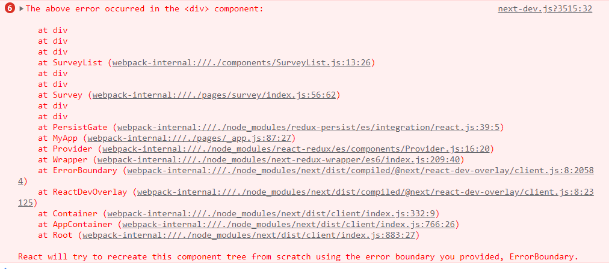
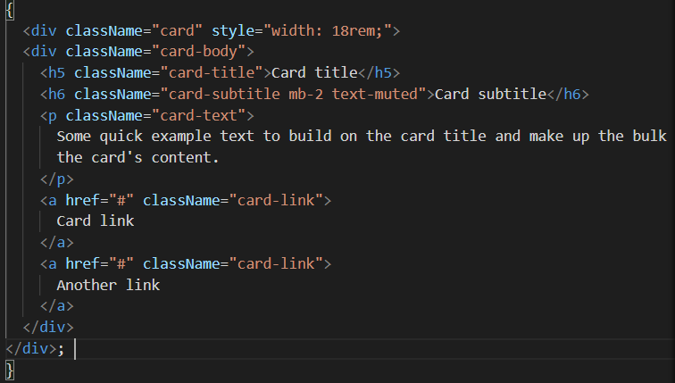
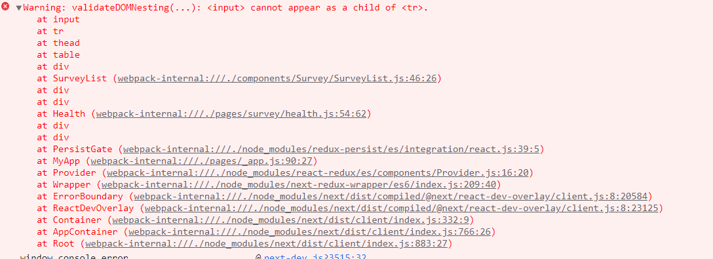

# Vote24
설문조사플랫폼 프로젝트 개발 일지

<br>
## 0121
#### 게시판 목록
- 서버에서 게시판 목록 데이터 받아오기
  ```
   const getList = async () => {
    const res = await axios.get(`http://teama205.iptime.org/api/event/947780`);
    console.log(typeof res);
    setList(res);
  };
  ```
  axios로 json 파일을 받아오면 res의 형태는 object이다.
  <br>
  ** 추가 수정사항
  
  - 지금은 게시글 제목을 눌렀을때만 link로 연결되는데 행 선택을 했을때 링크연결되게 만들기
  - 
- PostList.js
  - url을 상단에서 보내주는걸로 바꿔서 서비스공지사항, 병원공지사항, 병원이벤트 모두 사용할 수 있도록 만들기


<br>
## 0122
비동기로 state를 변경할때 주의할점
새로 불러오는 중에 삭제가 이루어지면 기존 items상태가 달라지지만 반영되지 않은상태로 렌더링된다.

<br>

그럴 때, 쓰는 prevItems

```
setItems((prevItems) => [...prevItems, ...reviews])
```
이렇게 쓰면됌

// 기본 submit기능인 페이지이동기능을 막아준다. = preventDefault();

<br>

- [x] navbar에서 class라고 씀!! className으로 수정 요청 - 지후님
- [x] link.js에서도

- 파일 인풋태그는 무조건 비제어 컴포넌트로로 해야한다. = 그래서 파일인풋에서는 value 프롭을 쓰면 안된다. 
  파일인풋에서 밸류는 파일이름으로,  
  html에서 파일인풋은 사용자만 바꿀수 있다 = 자바스크립트에서는 바꿀수 없다. = 보안을 위해서 웹브라우저는 파일경로를 숨겨주는건데 

<br>

- formdata를 console.log로 볼 수 없다.

  FormData 객체에 대한 설명은 MDN에 위와 같이 안내되어 있다. 단순한 객체가 아닌 XMLHttpRequest 전송을 위해 설계된 특수한 객체 형태라고 볼 수 있다.

  따라서 문자열화할 수 없는 객체이기 때문에 console.log를 사용해서 프린트할 수 없다.

  만약 전송 전에 FormData의 값을 확인하고 싶다면, 아래와 같이 FormData의 메소드를 사용해야 한다.

  // FormData의 key/ value 확인

  ```javascript
  for (let key of formData.keys()) {
    console.log(key);
  }
  
  for (let value of formData.values()) {
    console.log(value);
  }
  ```

  

## 0124

### * Todo

- [ ] 이벤트 목록, 생성, 상세 페이지 로직 완성
  - [ ] 이벤트 목록
    - [x] 목록 10개씩만 보이도록
  - [ ] 이벤트 상세페이지 
    - [ ] 들어오는 데이터 div 작성하기
- [ ] 추가 - 공지사항에도 똑같이 적용

<br>

#### * 추가 수정사항

- [ ] 이벤트 - create - 시작일이 마감일보다 늦는거 안되게 바꾸기
- [ ] 이벤트 - index.js - 시간 최신순으로 보이게 

<br>

### * TIL

- paging 로직 구현
  - 참조 : https://velog.io/@ksh4820/React-Pagination-%EA%B5%AC%ED%98%84
- cors 정책에 대해 읽어볼것
  - 참조:https://evan-moon.github.io/2020/05/21/about-cors/


<hr>


## 0125

### * Todo

- [x] 공지사항 페이지 연결
- [x] 공지사항 고정 유무 체크 박스 설정
- [x] 설문 목록 페이지 작성

<br>

#### * 추가 수정사항

- [ ] 공지사항 - 작성완료 버튼 누르면 상세페이지로 이동
- [ ] 공지사항 - 상세페이지에서 이전글 다음글 보게 하는 페이징기능


### * TIL

- 

  -> ErrorBoundary : 밑에 코드에서 style을 지우면 해결!

  


<br>


<hr>

## 0126

### * Todo

- [x] 설문 목록 페이지 -> 건강설문 / 서비스 만족도 조사 카테고리 나누고 링크연결

- [x] table 사용하는 모든 페이지에서 전체 선택/ 개별선택 체크박스 적용하기

- [x] 설문 상세페이지 관리자용 내용 출력 로직 작성

- [x] 설문 목록 페이지에서 버튼 만들기 (설문작성)

- [ ] 설문 목록 페이지에서 버튼 만들기 (선택-삭제)

- [ ] 게시글 생성 페이지 -> 작성버튼 누르면 방금 작성된 게시글 상세페이지로 이동

  

<br>

#### * 추가 수정사항

- [x] hospital_id 불러오는거 undfined뜸...!! => 지후님 로그인 확인 => index.js 수정하심

- [ ] 서버 : 설문 종료일이 현재시간보다 전이면 status값을 0으로 설문 안끝낫응면 status 값을 1로 요청 => 나중에 정렬할때도 status값으로 구분해서 보이는 로직이 있을때 프론트에서 하면 코드 더럽;;

- [x] 서버 : 주관식 답변들은 안들어오는지 -> 설문상세페이지에서

- [ ] 효정 : List 컴포넌트들로 들어가면 뜨는 경고창 해결하기

  

- [x] 목록에서 눌러서 디테일로가면 상세내용이 나오는데 / 주소에서 바로 가면 빈배열이 들어옴 ex)28번설문..!

아래처럼 코드 수정후 해결
  


### * TIL

- 이제 map함수 잘 쓸 수 있다.!!! 히히히
<br>

<hr>

## 0126

### * Todo

- [x] 설문 목록 페이지 -> 건강설문 / 서비스 만족도 조사 카테고리 나누고 링크연결

- [x] table 사용하는 모든 페이지에서 전체 선택/ 개별선택 체크박스 적용하기

- [x] 설문 상세페이지 관리자용 내용 출력 로직 작성

- [x] 설문 목록 페이지에서 버튼 만들기 (설문작성)

- [ ] 설문 목록 페이지에서 버튼 만들기 (선택-삭제)

- [ ] 게시글 생성 페이지 -> 작성버튼 누르면 방금 작성된 게시글 상세페이지로 이동

  

<br>

#### * 추가 수정사항

- [x] hospital_id 불러오는거 undfined뜸...!! => 지후님 로그인 확인 => index.js 수정하심

- [ ] 서버 : 설문 종료일이 현재시간보다 전이면 status값을 0으로 설문 안끝낫응면 status 값을 1로 요청 => 나중에 정렬할때도 status값으로 구분해서 보이는 로직이 있을때 프론트에서 하면 코드 더럽;;

- [x] 서버 : 주관식 답변들은 안들어오는지 -> 설문상세페이지에서

- [ ] 효정 : List 컴포넌트들로 들어가면 뜨는 경고창 해결하기

  

- [x] 목록에서 눌러서 디테일로가면 상세내용이 나오는데 / 주소에서 바로 가면 빈배열이 들어옴 ex)28번설문..!

아래처럼 코드 수정후 해결
  


### * TIL

- 이제 map함수 잘 쓸 수 있다.!!! 히히히
<br>
 
 
 0223
 - table 행 눌렀을때 링크이동 코드 작성
 - 레이아웃 css 적용

해야할일 
-getServerSideProps vs useffect 공부
