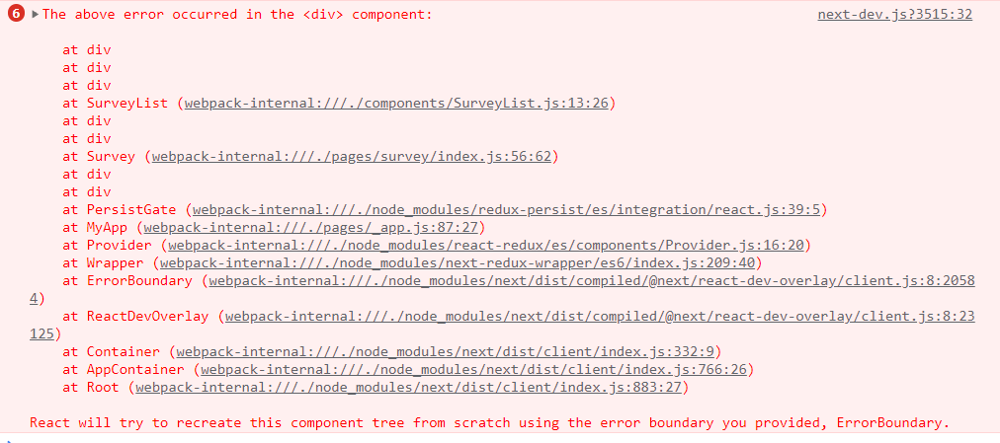
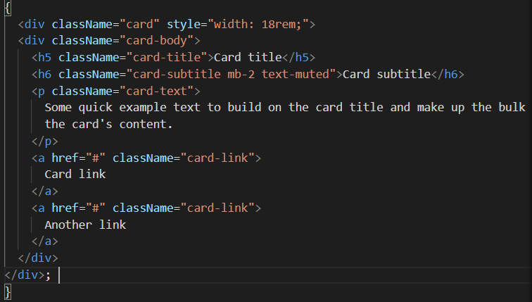
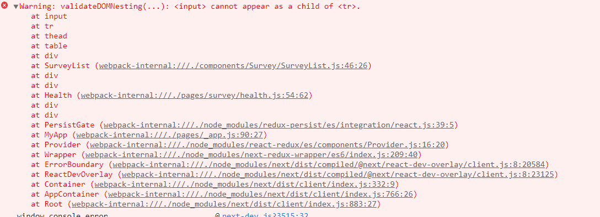

# Vote24
설문조사플랫폼 프로젝트 개발 일지

<br>
## 0121
#### 게시판 목록
- 서버에서 게시판 목록 데이터 받아오기
  ```
   const getList = async () => {
    const res = await axios.get(`http://teama205.iptime.org/api/event/947780`);
    console.log(typeof res);
    setList(res);
  };
  ```
  axios로 json 파일을 받아오면 res의 형태는 object이다.
  <br>
  ** 추가 수정사항
  
  - 지금은 게시글 제목을 눌렀을때만 link로 연결되는데 행 선택을 했을때 링크연결되게 만들기
  
- PostList.js
  - url을 상단에서 보내주는걸로 바꿔서 서비스공지사항, 병원공지사항, 병원이벤트 모두 사용할 수 있도록 만들기

<br>

## 0122
### TIL

- 비동기로 state를 변경할때 주의할점
  새로 불러오는 중에 삭제가 이루어지면 기존 items상태가 달라지지만 반영되지 않은상태로 렌더링된다.

​	<br>

​	그럴 때, 쓰는 **prevItems** // // 기본 submit기능인 페이지이동기능을 막아준다. = preventDefault();

```
setItems((prevItems) => [...prevItems, ...reviews])
```
- [link.js 컴포넌트] 파일 인풋태그는 무조건 비제어 컴포넌트로로 해야한다. 
  = 그래서 파일인풋에서는 value 프롭을 쓰면 안된다. 
  파일인풋에서 밸류는 파일이름으로,  html에서 파일인풋은 사용자만 바꿀수 있다.
  = 자바스크립트에서는 바꿀수 없다. 
  = 보안을 위해서 웹브라우저는 파일경로를 숨겨주는건데 

- formdata를 console.log로 볼 수 없다.

  FormData 객체에 대한 설명은 MDN에 위와 같이 안내되어 있다. 
  단순한 객체가 아닌 XMLHttpRequest 전송을 위해 설계된 특수한 객체 형태라고 볼 수 있다.
  
  따라서 문자열화할 수 없는 객체이기 때문에 console.log를 사용해서 프린트할 수 없다.
  
  만약 전송 전에 FormData의 값을 확인하고 싶다면, 아래와 같이 FormData의 메소드를 사용해야 한다.
  
  // FormData의 key/ value 확인
  
  ```javascript
  for (let key of formData.keys()) {
    console.log(key);
  }
  
  for (let value of formData.values()) {
    console.log(value);
  }
  ```
  
  <hr>
  
  #### 팀원 요청사항
  
  - [x] navbar에서 class라고 씀!! className으로 수정 요청 - 지후님
  
  <br>

## 0124

### * Todo

- [x] 이벤트 목록, 생성, 상세 페이지 로직 완성
  - [x] 이벤트 목록
    - [x] 목록 10개씩만 보이도록
  - [x] 이벤트 상세페이지 
    - [x] 들어오는 데이터 div 작성하기
- [x] 추가 - 공지사항에도 똑같이 적용

<br>

#### * 추가 수정사항

- [ ] 이벤트 - create - 시작일이 마감일보다 늦는 거 안되게 바꾸기
- [ ] 이벤트 - index.js - 시간 최신순으로 보이게 

<br>

### * TIL

- paging 로직 구현
  - 참조 : https://velog.io/@ksh4820/React-Pagination-%EA%B5%AC%ED%98%84
- cors 정책에 대해 읽어볼것
  - 참조:https://evan-moon.github.io/2020/05/21/about-cors/


<hr>


## 0125

### * Todo

- [x] 공지사항 페이지 연결
- [x] 공지사항 고정 유무 체크 박스 설정
- [x] 설문 목록 페이지 작성

<br>

#### * 추가 수정사항

- [ ] 공지사항 - 작성완료 버튼 누르면 상세페이지로 이동
- [ ] 공지사항 - 상세페이지에서 이전글 다음글 보게 하는 페이징기능


### * TIL

- 

  -> ErrorBoundary : 밑에 코드에서 style을 지우면 해결!

  


<br>


<hr>

## 0126

### * Todo

- [x] 설문 목록 페이지 -> 건강설문 / 서비스 만족도 조사 카테고리 나누고 링크연결

- [x] table 사용하는 모든 페이지에서 전체 선택/ 개별선택 체크박스 적용하기

- [x] 설문 상세페이지 관리자용 내용 출력 로직 작성

- [x] 설문 목록 페이지에서 버튼 만들기 (설문작성)

- [ ] 설문 목록 페이지에서 버튼 만들기 (선택-삭제)

- [ ] 게시글 생성 페이지 -> 작성버튼 누르면 방금 작성된 게시글 상세페이지로 이동

  

<br>

#### * 추가 수정사항

- [x] hospital_id 불러오는거 undfined뜸...!! => 지후님 로그인 확인 => index.js 수정하심

- [ ] 서버 : 설문 종료일이 현재시간보다 전이면 status값을 0으로 설문 안끝낫응면 status 값을 1로 요청 => 나중에 정렬할때도 status값으로 구분해서 보이는 로직이 있을때 프론트에서 하면 코드 더럽;;

- [x] 서버 : 주관식 답변들은 안들어오는지 -> 설문상세페이지에서

- [ ] 효정 : List 컴포넌트들로 들어가면 뜨는 경고창 해결하기

  

- [x] 목록에서 눌러서 디테일로가면 상세내용이 나오는데 / 주소에서 바로 가면 빈배열이 들어옴 ex)28번설문..!

아래처럼 코드 수정후 해결
  


### * TIL

- 이제 map함수 잘 쓸 수 있다.!!! 히히히
<br>

<hr>

## 0126

### * Todo

- [x] 설문 목록 페이지 -> 건강설문 / 서비스 만족도 조사 카테고리 나누고 링크연결

- [x] table 사용하는 모든 페이지에서 전체 선택/ 개별선택 체크박스 적용하기

- [x] 설문 상세페이지 관리자용 내용 출력 로직 작성

- [x] 설문 목록 페이지에서 버튼 만들기 (설문작성)

- [ ] 설문 목록 페이지에서 버튼 만들기 (선택-삭제)

- [ ] 게시글 생성 페이지 -> 작성버튼 누르면 방금 작성된 게시글 상세페이지로 이동

  

<br>

#### * 추가 수정사항

- [x] hospital_id 불러오는거 undfined뜸...!! => 지후님 로그인 확인 => index.js 수정하심

- [ ] 서버 : 설문 종료일이 현재시간보다 전이면 status값을 0으로 설문 안끝낫응면 status 값을 1로 요청 => 나중에 정렬할때도 status값으로 구분해서 보이는 로직이 있을때 프론트에서 하면 코드 더럽;;

- [x] 서버 : 주관식 답변들은 안들어오는지 -> 설문상세페이지에서

- [ ] 효정 : List 컴포넌트들로 들어가면 뜨는 경고창 해결하기

  

- [x] 목록에서 눌러서 디테일로가면 상세내용이 나오는데 / 주소에서 바로 가면 빈배열이 들어옴 ex)28번설문..!

아래처럼 코드 수정후 해결
  


### * 일기야?

- 이제 map함수 잘 쓸 수 있다.!!! 히히히
<br>

# 0223

### * Todo

- [x] table 행 눌렀을때 링크이동 코드 작성

- [x] 레이아웃 css 적용

- [ ] getServerSideProps vs useffect 공부

  

# 0204

### * Todo

- [ ] 팀정보작성

- [x] 게시판 레이아웃 수정중
- [x] 이전페이지 다음페이지 구현중 => 서버에서 조작해서 데이터 넘겨주기로(id/title)
- [ ] 오류수정
  - 삭제 후에 페이지네이션 조작하면 삭제한 이후 리스트로 조작안되고 이전의 껄로 조작됌 


#### * TIL

- classnames 모듈 -> component에서 관련 css파일 직접 import해서 사용하면서 부트스트랩 작성도 편함

  

# 0205

- 필수 입력해야하는 것들 입력안된경우 경고창 뜨게 작성한 후 바뀐점


오류사항 : 

공지사항 작성에서 전에 작성한 적이 있으면 이번에 작성한 글의 아이디 안뜨고 전에 작성한 글의 아이디가 뜨고
전에 작성한 적이 없으면 0이뜬다. -> 백엔드 코드 수정

# **0207**

#### TIL

- router.push -> 클라이언트 렌더링
  -> 버튼안에 onclick해서 거기서 router.push
- Link -> 서버사이드 렌더링
  ->link태그안에 버튼태그를 넣는다.
  ** Routing관련 참고자료
  https://salgum1114.github.io/nextjs/2019-05-24-nextjs-static-website-4/

- href 작성법
     <Link href={"create"} passHref>
              <a className={cn(listbtn.createbtn, "btn btn-primary")}>설문작성</a>
            </Link>

​			href에서 "create" 치면 해당페이지에서 앞에 주소에 플러스만된다
​			=>http://localhost:3000/survey/create
​			href=("/create") 라고 작성하면
​			=>http://localhost:3000/create
​			href=("/survey/create") 라고 작성하면
​			=>http://localhost:3000/survey/create


# 0208

### * Todo

- [x] 설문결과 상세페이지 (일반상세 / 더보기상세)

#### * TIL

- useEffect VS  getServerSideProps
참고: https://steadily-worked.tistory.com/m/849
https://cpro95.tistory.com/492
-ssr VS csr
참고: https://onlyfor-me-blog.tistory.com/387
- 

# 0209

### * Todo

- [x] chart.js 도입 설문 결과 통계 차트로 보여주기


# 0210 

### * Todo

- [x] 배포
  - front : nginx와 함께 docker에서 배포
    back 
    mysql
    docker-compose로 합침
- [x] 공지사항 / 이벤트 수정 로직 
  

# 0211

### * Todo

- [x] 데이터 수정

#### * TIL

- 데이터 수정관련
  - 참고자료 : https://gaemi606.tistory.com/entry/React-update-%EA%B5%AC%ED%98%84%ED%95%98%EA%B8%B0-onChange
- props는 readonly라는 사실..!! 대박적.. 그래서 state에 담아서 수정하라는..!!!
  - 참고자료 : https://velog.io/@oseo/React-state%EC%99%80-useState  : state vs useState
- 체크박스 데이터 수정
  - 기존 데이터를 받아온 상태로 radio 체킹되어있고 누를때마다 value값 변경으로  변화 /
  - 참고자료 : https://note.redgoose.me/article/1848/
    

```
const handlefixed = (e) => {
    console.log(e.target);
    handleChange("fixed", e.target.value);
  };
  
<input
              id="no_fixed"
              type="radio"
              name="fixed"
              defaultValue={0}  //value로 넣으면 경고뜸: input안에서 onchange랑 value 값이 동시에 있기때문에
              checked={values.fixed == 0} // 바뀌는 데이터에 따라서 체킹상태 곧바로 적용
              onChange={handlefixed} // 누르면 defaultvalue값이 전달되어 data 수정됌
            />
```


# 0213

### * Todo

- [x] 디테일 수정

#### * TIL

- textarea에서 엔터값이 db에는 \n\r로 저장된다. 
  - div안에 출력시 <pre>라는 태그를 사용해도 엔터가 적용되지만 이는 보안에 취약하다고 하여
    아래 코드를 추가하였다.

```
{data.context &&
          data.context.split("\n").map((line) => {
            return (
              <span>
                {line}
                <br />
              </span>
            );
          })}
```

- get요청실패시 router.push('404') => url로 접근했을때 병원코드가 들어가지 않아서 404페이지를 보여준다.
- 사이트 타이틀 바꾸기 
```
<HEAD>
<link href="favicon.io" ref="icon"/>
<title>Vote 24</title>
</HEAD>
```


# 0214

### * Todo

- [x] 디테일 수정

#### * TIL

- 고정공지를 페이지네이션에 붙여서 갈려고 공지 get data에서 fixed==1인것만 useEffect안에서 따로 뽑으려고 하는데 처음엔 map, foreach를 쓰면서 그안에 if문으로 구분하려해도 들어가질 않았다. ㅠㅠ

  - 그래서 찾아보고 filter를 사용해볼 생각이다. 
  - 참고: https://jaeheon.kr/166

- 고정 공지를 포함한 페이지네이션.... 계산하는거 왜케 머리안굴러가.. ㅠ 오래걸렸지만 성공.

  - 고정공지를 제외한 남은 목록의 전체 번호 계산
    indexlst = 현 페이지번호에 들어온 데이터들의 전체목록에서의 인덱스 값 전달 
    index (한페이지당 6개게시글만 보인다면 index =0~5) = 현 페이지에서 나타나는 인덱스 
    postsperpage = 한페이지당 게시글 수
    fixedCnt = 고정게시글 수

    indexlst[Math.abs(index-postsPerPage)-1]-fixedCnt+1 = 고정공지를 제외한 게시글들의 번호 

    [Math.abs(index-postsPerPage)-1] = 현재 페이지 인덱스가 위에서부터 아래로 0 1 2 3 4 5 인데 고정글이 4개라면 4, 5가 0, 1 돼야함 


# 0215-0216

### * Todo

- [x] 디테일 수정

#### * TIL

- 설문 결과 페이지 차트 도입 -> char.js 사용
- 수정페이지에서 기존 파일명 보기
- 참고 : https://www.phpschool.com/gnuboard4/bbs/board.php?bo_table=qna_function&wr_id=152467&page=3600

